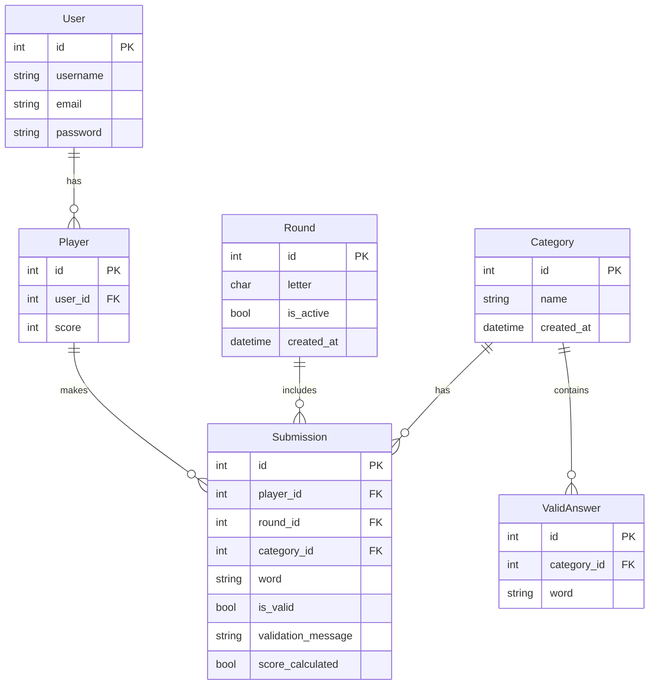

# **Stop! Game - Singleplayer Version**

## **Table of Contents**
1. [Introduction](#introduction)
2. [User Stories](#user-stories)
3. [ER Diagram](#er-diagram)
4. [Features](#features)
5. [Test & Debug](#test--debug)
6. [Resources](#resources)

---

## **Introduction**

**Stop!** is a Django-based single-player word game where users compete against the clock to generate words for predefined categories that match a randomly chosen letter. The game demonstrates the use of Django's powerful framework features for backend development, including models, views, templates, form handling, and database integration.

The goal of this project is to highlight Django’s capabilities as a framework for building dynamic, scalable web applications.

---

## **User Stories**

### **Player Stories**
- **As a player**, I want to start a new game round with a randomly generated letter and see a timer, so I can compete against myself.
- **As a player**, I want to submit words for categories like "Animal," "Country," "Food," etc., to earn points.
- **As a player**, I want to see detailed results after a game round to evaluate my performance.
- **As a player**, I want to suggest a new word and earn bonus points if it is approved by an admin.

### **Admin Stories**
- **As an admin**, I want to review and validate submissions to ensure they follow the rules of the game.
- **As an admin**, I want to approve or reject player-submitted words, expanding the database of valid answers.

### **Developer/Academic Focus**
- **As a developer**, I want to showcase the use of Django's features (models, views, templates, form handling, and database queries) in building a web application.
- **As a professor/reviewer**, I want to evaluate the proper use of Django as a framework to structure and manage this application.

---

## **ER Diagram**



---

## **Features**

### **Gameplay Features**
1. **Game Rounds**:
   - Start a round with a randomly generated letter.
   - Timer set for 60 seconds to challenge the player.
   - Submit words for categories such as "Animal," "Country," and "Food."

2. **Word Validation**:
   - Words are validated in real-time against a database of valid answers.
   - Validation checks include:
     - Does the word start with the correct letter?
     - Is the word valid for the chosen category?

3. **Results Page**:
   - Displays all submissions for the round.
   - Shows points earned for valid and unique words.
   - Tracks cumulative player scores.

### **Technological Features**
1. **Django Framework**:
   - Models for managing users, rounds, submissions, and categories.
   - Views and templates for dynamic content generation.
   - Form handling to process user inputs efficiently.

2. **Bootstrap Integration**:
   - Used for responsive design and user-friendly interfaces.
   - Clean and professional-looking layout for the game.

3. **Dark Mode**:
   - A toggle to switch between light and dark themes for better accessibility.

---

## **Test & Debug**

### **Test Cases**
1. **Game Round**:
   - Verify that a new round generates a random letter and displays the timer.
   - Ensure categories and submission forms load correctly.

2. **Word Submission**:
   - Check validation logic for:
     - Correct starting letter.
     - Validity against the category.
   - Ensure invalid words are flagged with appropriate messages.

3. **Results Page**:
   - Confirm that points are calculated correctly based on validity and uniqueness.
   - Ensure cumulative scores are updated properly.

4. **User Interface**:
   - Test responsiveness on mobile, tablet, and desktop devices.
   - Verify dark mode toggle works as intended.

5. **Performance**:
   - Validate that database queries are optimized and do not cause delays.

### **Debugging Tools**
- **Logging**: Debug issues with word validation and submission logic using Django’s logging framework.
- **Django Debug Toolbar**: Identify slow queries and optimize them.
- **Browser DevTools**: Test responsiveness and ensure proper rendering.

---

## **Resources**

### **Tools and Libraries**
- **Django**: Framework for backend logic and database handling.
- **Bootstrap**: Frontend framework for styling and responsiveness.
- **SQLite**: Database used for development.
- **Mermaid**: For generating the ER diagram.

### **References**
- [Django Documentation](https://docs.djangoproject.com/)
- [Bootstrap Documentation](https://getbootstrap.com/)
- [Mermaid Documentation](https://mermaid.js.org/)

---

## **How to Run**

### **Prerequisites**
1. **Python**: Ensure Python 3.8 or above is installed.
2. **Virtual Environment**: Set up a virtual environment for the project dependencies.

### **Steps to Run**
1. Clone the repository:
   ```bash
   git clone https://github.com/alanmaizon/stop_game.git
   cd stop_game
   ```

2. Set up a virtual environment:
   ```bash
   python -m venv venv
   source venv/bin/activate  # Windows: venv\Scripts\activate
   ```

3. Install dependencies:
   ```bash
   pip install -r requirements.txt
   ```

4. Apply migrations:
   ```bash
   python manage.py migrate
   ```

5. Run the development server:
   ```bash
   python manage.py runserver
   ```

6. Access the application:
   Open your browser and navigate to `http://127.0.0.1:8000`.

---


## Module 5 - UCD PA - Alan Maizon
**[Github (Public Repository)](https://github.com/alanmaizon/stop_game/)**
