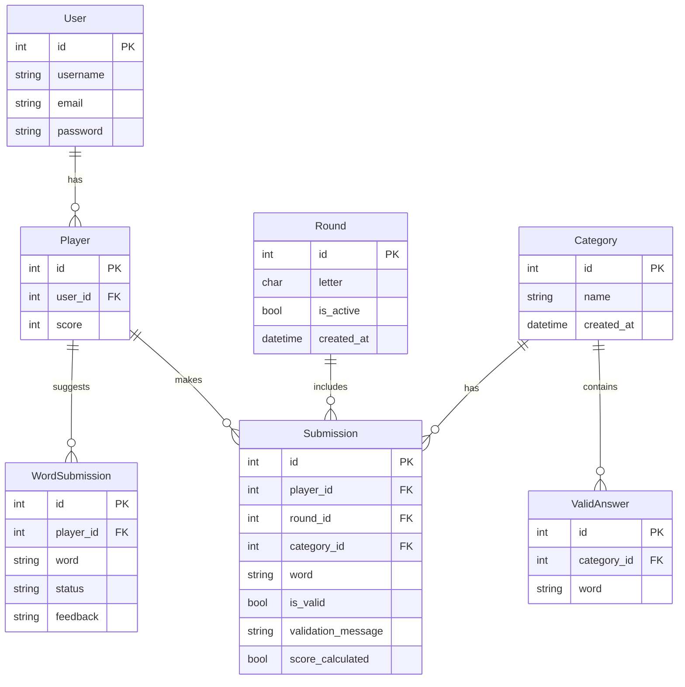

# **Stop! Game - Singleplayer Version**

## **Table of Contents**
1. [Introduction](#introduction)
2. [About the Game](#about-the-game)
3. [ER Diagram](#er-diagram)
4. [Features](#features)
5. [How to Play](#how-to-play)
6. [Contribute](#contribute)
7. [User Stories](#user-stories)
8. [Test Cases](#test-cases)
9. [Resources](#resources)

---

## **Introduction**

**Stop!** is a Django-based single-player word game where users compete against the clock to generate words for predefined categories that match a randomly chosen letter. The project demonstrates the use of Django's key features, including models, views, templates, form handling, and database integration.

The primary goal is to highlight Django’s potential for building scalable web applications while delivering an engaging word game experience.

---

## **About the Game**

Stop! is a digital adaptation of the classic pen-and-paper game. It challenges players’ vocabulary and creativity by requiring quick thinking under time constraints. The game is perfect for building your vocabulary while competing against yourself.

---

## **ER Diagram**

Here’s the **Entity-Relationship Diagram** for the game, created using **Mermaid**:

---

## **Features**

### **Gameplay Features**
1. **Game Rounds**:
   - Start a round with a randomly generated letter.
   - Timer set for 60 seconds to challenge the player.
   - Submit words for categories such as "Animal," "Country," and "Food."

2. **Word Validation**:
   - Words are validated in real-time against a database of valid answers.
   - Validation checks include:
     - Does the word start with the correct letter?
     - Is the word valid for the chosen category?

3. **Results Page**:
   - Displays all submissions for the round.
   - Shows points earned for valid and unique words.
   - Tracks cumulative player scores.

4. **Suggest a New Word**:
   - Players can suggest words for categories.
   - Admins can approve/reject suggestions to expand the game’s word database.
   - Players earn bonus points for approved suggestions.

5. **Responsive Design**:
   - User-friendly interface styled with Bootstrap.
   - Optimized for mobile, tablet, and desktop devices.

6. **Dark Mode**:
   - A toggle to switch between light and dark themes for better accessibility.

---

## **How to Play**

The rules are simple:
1. Start a round with a randomly chosen letter.
2. Fill in categories like "Animal," "Country," and "Food" with words starting with that letter.
3. Press "Submit" before the timer runs out.
4. See your score and evaluate your performance on the results page!

---

## **Contribute**

Players can contribute to the game by suggesting new words:
1. Submit words that are missing from the current database.
2. Admins review and approve the suggestions.
3. Earn bonus points for every approved word.

---

## **User Stories**

### **Player Stories**
- **As a player**, I want to start a new game round with a randomly generated letter and see a timer, so I can compete against myself.
- **As a player**, I want to submit words for categories like "Animal," "Country," "Food," etc., to earn points.
- **As a player**, I want to see detailed results after a game round to evaluate my performance.
- **As a player**, I want to suggest a new word and earn bonus points if it is approved by an admin.

### **Admin Stories**
- **As an admin**, I want to review and validate submissions to ensure they follow the rules of the game.
- **As an admin**, I want to approve or reject player-submitted words, expanding the database of valid answers.

### **Developer/Academic Focus**
- **As a developer**, I want to showcase the use of Django's features (models, views, templates, form handling, and database queries) in building a web application.
- **As a professor/reviewer**, I want to evaluate the proper use of Django as a framework to structure and manage this application.

---

## **Test Cases**

| **Test Case**                          | **Action Taken**                                  | **Expected Result**                                    | **Actual Result**                                    | **Status** |
|-----------------------------------------|--------------------------------------------------|--------------------------------------------------------|------------------------------------------------------|------------|
| **User Registration**                   | Register a new user                              | User account created successfully                     | Registration successful, user added to database     | ✅ Pass    |
| **Login**                               | Log in with registered credentials              | User is redirected to the lobby                       | Login successful, user redirected                   | ✅ Pass    |
| **Invalid Login**                        | Enter incorrect credentials                     | Error message displayed                               | Error message appears, no redirection              | ✅ Pass    |
| **Logout**                              | Click logout button                             | User is logged out and redirected to login page      | Works as expected                                   | ✅ Pass    |
| **Password Reset - Valid Email**        | Enter registered email for password reset       | Reset email sent, user gets confirmation message     | Email received, reset link works                   | ✅ Pass    |
| **Password Reset - Invalid Email**      | Enter unregistered email                        | Error message displayed                              | Error message appears                              | ✅ Pass    |
| **Start Game**                          | Click “Start Game”                              | New game round starts, letter is assigned            | Works as expected                                  | ✅ Pass    |
| **Submit Words**                        | Fill categories and submit words                | Words stored, validation applied                     | Words stored, validation works                     | ✅ Pass    |
| **Invalid Word Submission**             | Submit a word that doesn't match criteria       | Word marked as invalid, reason displayed             | Works as expected                                  | ✅ Pass    |
| **Results Page**                        | View results after a round                      | Shows player’s score and word validation             | Works as expected                                  | ✅ Pass    |
| **Lobby Leaderboard**                   | View lobby page                                 | Shows ranked players with scores                     | Players displayed correctly                        | ✅ Pass    |
| **Submit a New Word Suggestion**        | Use form to suggest a new word                 | Submission stored for admin review                   | Word appears in admin panel                        | ✅ Pass    |
| **Admin - Approve Word**                | Admin approves a suggested word                | Word is added to the database, user gets points     | Word added successfully, user received points      | ✅ Pass    |
| **Admin - Reject Word**                 | Admin rejects a suggested word                 | Word is marked as rejected, player notified         | Works as expected                                  | ✅ Pass    |
| **Notifications**                       | View unread notifications                      | Shows pending messages                              | Works as expected                                  | ✅ Pass    |
| **Archive Notifications**               | Click "Mark as Read" and then archive          | Moves notification to archived section              | Works as expected                                  | ✅ Pass    |
| **Dark Mode Toggle**                    | Click the dark mode switch                     | UI switches between light and dark themes           | Works as expected                                  | ✅ Pass    |
| **Static Assets (CSS, JS, Images)**     | Load the website in browser                    | Styles and images load correctly                    | Static assets load without issue                   | ✅ Pass    |
| **Cloud Deployment on Render**          | Access app via Render URL                      | App loads correctly, pages work                     | Works as expected                                  | ✅ Pass    |
| **Database Migration on AWS RDS**       | Run `migrate` command                          | No errors, database updates                         | Migrations applied successfully                    | ✅ Pass    |

---

## **Resources**

### **Tools and Libraries**  
- **Django**: Framework for backend logic and database handling.  
- **Bootstrap**: Frontend framework for styling and responsiveness.  
- **PostgreSQL (AWS RDS)**: Cloud-hosted database for production.  
- **Mermaid**: For generating the ER diagram.  

### **References**  
- [Django Documentation](https://docs.djangoproject.com/)  
- [Bootstrap Documentation](https://getbootstrap.com/)  
- [Mermaid Documentation](https://mermaid.js.org/)  
- [AWS RDS Documentation](https://docs.aws.amazon.com/rds/)  

---

## Module 5 - UCD PA - Alan Maizon
**[Github (Public Repository)](https://github.com/alanmaizon/stop_game/)**
